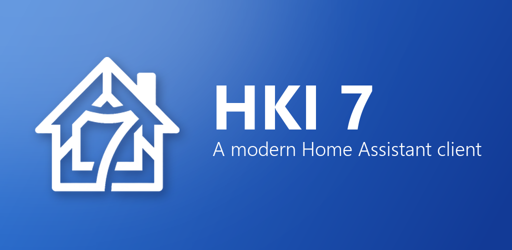

# HKI 7

{ .hki-hero }

**A modern [Home Assistant](https://www.home-assistant.io/) client for Android, built with
Jetpack Compose and Material 3.**

HKI 7 connects to your own Home Assistant server and nothing else — no developer servers, no
analytics, no ads, no tracking. Haven't set one up yet? A built-in demo home runs without a
server or an account. Running more than one Home Assistant? Connect to all of them.

-   :material-rocket-launch: **New here?**

    ---

    Install the app, connect it to your server, and get a dashboard on screen in a few minutes.

    [:octicons-arrow-right-24: Getting started](getting-started/index.md)

-   :material-book-open-variant: **Learn the app**

    ---

    Dashboards, widgets, rooms, notifications, presence and family sharing, one topic at a time.

    [:octicons-arrow-right-24: User guide](guide/index.md)

-   :material-help-circle: **Something's wrong**

    ---

    Connection problems, missing notifications, presence that won't update, and other common fixes.

    [:octicons-arrow-right-24: Troubleshooting](troubleshooting.md)

-   :material-frequently-asked-questions: **Quick answers**

    ---

    What HKI 7 is, what it needs, what it costs, and what it does with your data.

    [:octicons-arrow-right-24: FAQ](faq.md)

## What HKI 7 does

### Dashboards you actually want to look at

HKI 7 reads your existing Home Assistant setup — areas, floors, devices and entities — and builds
a first dashboard from it, then gets out of the way so you can rearrange it. Everything is
editable: buttons, button stacks, badges and custom popups, each with its own layout, width,
corner radius, icon and background. The complete Material Design Icons and Simple Icons sets are
bundled as webfonts, so icons work with no network dependency.

[:octicons-arrow-right-24: Dashboards](guide/dashboards.md) ·
[:octicons-arrow-right-24: Widgets](guide/widgets.md)

### Controls for every domain

Lights, climate, covers, fans, locks, media players, vacuums, humidifiers, alarms and cameras each
get a dedicated dialog rather than a generic more-info sheet. On top of that there are dedicated
full screens for Climate, Energy, Security, Vacuum and Battery, live camera streams, live cleaning
maps for [Valetudo](https://valetudo.cloud/) robots, and per-room
[Adaptive Lighting](https://github.com/basnijholt/adaptive-lighting) controls.

[:octicons-arrow-right-24: Controls and screens](guide/controls.md)

### Notifications and a timeline of the house

Push notifications arrive from your own server over the app's own connection, including the
`actions` buttons the official companion app supports — tapping one fires the same
`mobile_app_notification_action` event, so automations written for the official app work
unchanged. The Events tab reads Home Assistant's logbook live and shows what the house has been
doing: the front door opening, a light going off, someone arriving home.

[:octicons-arrow-right-24: Notifications](guide/notifications.md) ·
[:octicons-arrow-right-24: Event timeline](guide/events.md)

### Family sharing that never leaves your home

Optional, and powered by the companion
[HKI 7 Cloud](https://github.com/jimz011/HKI7-Cloud-Component) integration — which stores
everything on your own Home Assistant. An admin builds one dashboard and publishes it to specific
people or to everyone, hides views, rooms or individual entities from particular family members,
sets per-user permissions, and sees which HKI version each family device runs.

[:octicons-arrow-right-24: Family sharing](guide/family-sharing.md)

### Presence without the battery cost

Location is event-driven — geofences and WorkManager rather than continuous tracking — designed
for battery parity with the official app. It is fully optional; the app works without location
access at all.

[:octicons-arrow-right-24: Presence and location](guide/presence.md)

## Requirements

| | |
|---|---|
| **Android** | 12 or newer (minSdk 31) |
| **Home Assistant** | Any reachable instance — local URL, remote URL, or Home Assistant Cloud (Nabu Casa) |
| **Family sharing** | Additionally needs [HKI 7 Cloud](https://github.com/jimz011/HKI7-Cloud-Component) `0.10.0` or newer, installed via HACS |

## Licensing

HKI 7 uses an open-core model. The community source code is licensed under the
[Mozilla Public License 2.0](https://www.mozilla.org/MPL/2.0/); separately marked premium assets
remain proprietary. The open-source core is fully usable without Premium. See
[LICENSE](https://github.com/jimz011/android-hki7/blob/main/LICENSE) for the details.

!!! note "About AI use"

    This project was created with the help of AI, including Claude and OpenAI models. If you
    dislike AI being used in projects, then do not install this.
